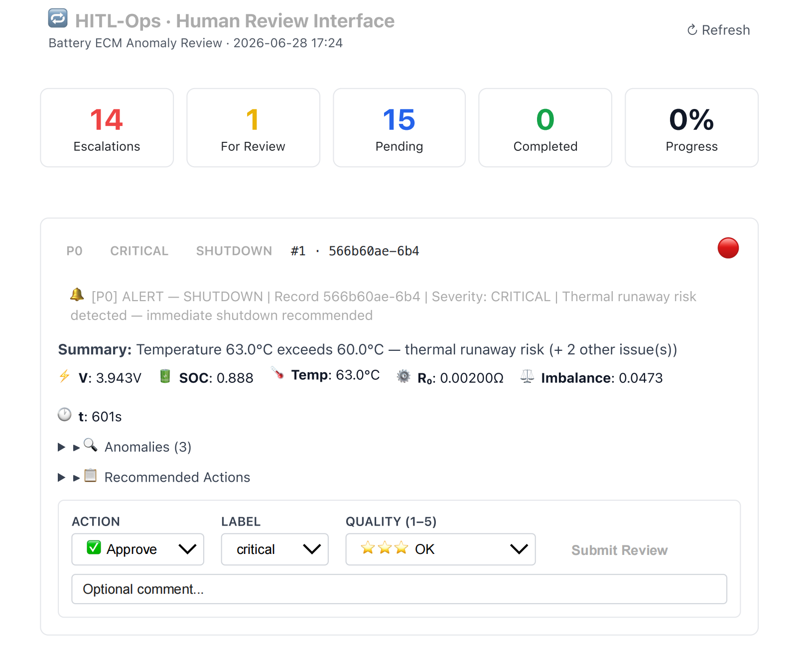
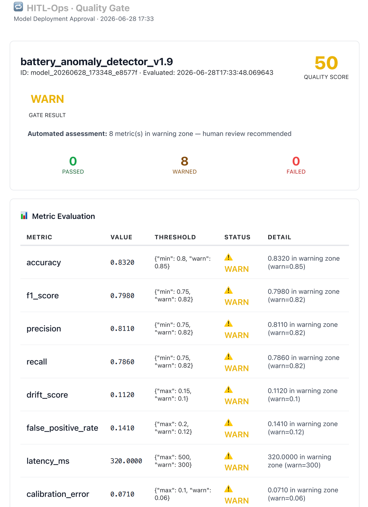
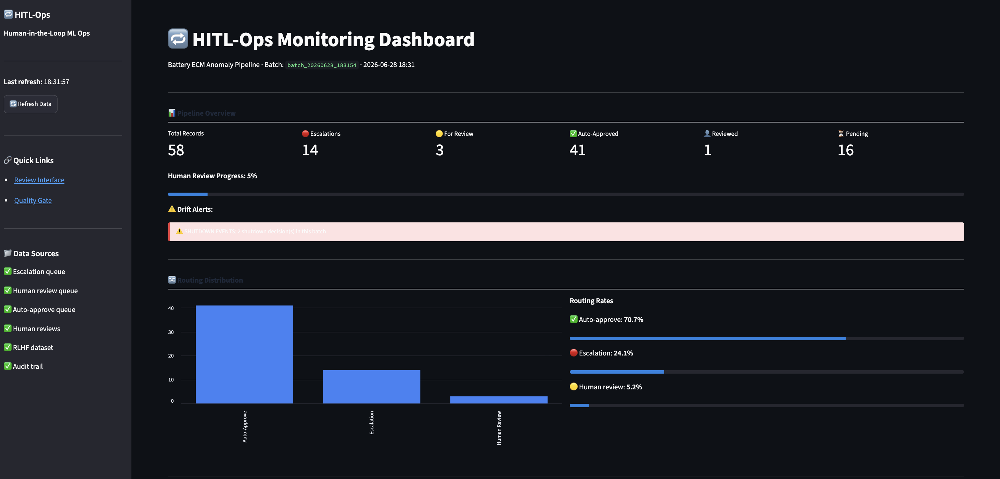
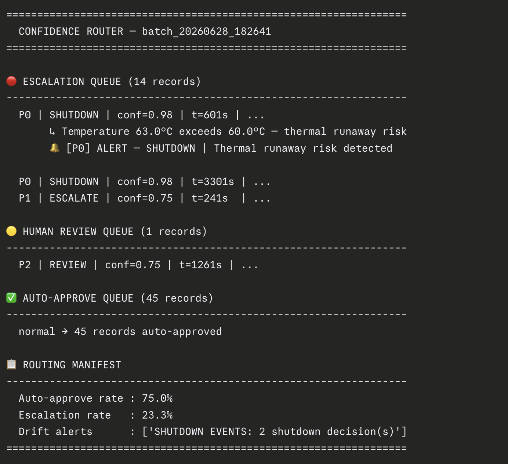

# HITL-Ops 🔁

> **Human-in-the-Loop ML Operations Platform**
> End-to-end pipeline where humans and AI collaborate — agents analyze, humans decide, models improve.

---

## 🎯 What This Is

HITL-Ops is a production-grade ML operations system that combines **4 core ML engineering concepts** into one cohesive platform:

| Concept | Component |
|---|---|
| Multi-Agent Pipeline | 4 specialized agents with HITL checkpoints |
| Battery Anomaly Detection | Real ECM sensor data — voltage, SOC, temperature |
| ML Quality Gate | Human approval before any model deployment |
| RLHF Feedback Loop | Human corrections → training dataset → model improves |

---

## 🏗️ Architecture

```
DATA IN (Battery Sensors / ECM Simulation)
        ↓
MULTI-AGENT PIPELINE
  Agent 1 — Extraction       → structured features
  Agent 2 — Anomaly Detection → flags + severity
  Agent 3 — Classification    → normal / warning / critical
  Agent 4 — Decision          → ignore / review / escalate / shutdown
        ↓
CONFIDENCE ROUTER
  High   → auto-approve
  Medium → human review
  Low    → escalate + alert
        ↓
HUMAN REVIEW INTERFACE (browser UI)
  Review · Correct · Rate (1–5 for RLHF)
        ↓
QUALITY GATE
  Model metrics evaluated
  Human approves or rejects deployment
  Auto-rollback on rejection
        ↓
FEEDBACK LOOP
  Corrections → RLHF dataset
  Model retrains and improves
        ↓
AUDIT + DASHBOARD
  Full audit trail · Streamlit monitoring
```

---
## 📸 Screenshots

### Human Review Interface


### Quality Gate


### Streamlit Dashboard


### Pipeline Terminal Output



## 📦 Project Structure

```
hitl-ops/
├── agents/
│   ├── extraction_agent.py       # Agent 1 — ECM data extraction + feature engineering
│   ├── anomaly_agent.py          # Agent 2 — anomaly detection (voltage, temp, SOC, imbalance)
│   ├── classification_agent.py   # Agent 3 — ML classification with confidence scoring
│   └── decision_agent.py         # Agent 4 — decision engine with P0–P4 priority routing
│
├── hitl/
│   ├── confidence_router.py      # Routes by confidence threshold + drift detection
│   └── review_interface.py       # Browser-based human review UI (localhost:8765)
│
├── quality_gate/
│   └── quality_gate.py           # Model evaluation + human deployment approval (localhost:8766)
│
├── feedback_loop/
│   └── feedback_loop.py          # RLHF dataset builder + multi-format exporter
│
├── dashboard/
│   └── app.py                    # Streamlit monitoring dashboard (localhost:8501)
│
├── workflows/
│   └── hitl_ops_full.json        # Complete n8n workflow — schedule + webhook triggers
│
├── data/
│   ├── battery_sensors/          # Sample battery sensor data
│   └── sample_models/            # Sample ML models for quality gate
│
├── results/                      # Pipeline outputs (gitignored)
│   ├── approved/                 # Approved model manifests
│   ├── rejected/                 # Rejected model manifests
│   ├── audit_trail.json          # Full audit trail
│   └── rlhf_dataset.jsonl        # RLHF training dataset
│
├── requirements.txt
└── README.md
```

---

## ⚙️ Tech Stack

| Layer | Technology |
|---|---|
| Language | Python 3.10+ |
| Agents & Logic | Pure Python + scikit-learn |
| Deep Learning | PyTorch 2.6 (MPS — Apple M2) |
| LLM | Ollama — mistral + nomic-embed-text |
| Vector Store | FAISS |
| Human Review UI | Python (browser-based, zero dependencies) |
| Orchestration | n8n |
| Dashboard | Streamlit |
| Data Source | battery-ecm-simulation (ECM model) |

---

## 🚀 Quick Start

```bash
# Clone the repo
git clone https://github.com/PRATdoppelEK/hitl-ops.git
cd hitl-ops

# Install dependencies
pip install -r requirements.txt
```

---

## ▶️ Quick Demo

```bash
# 1. Run the full pipeline (all 4 agents + router)
python hitl/confidence_router.py

# 2. Open human review UI
python hitl/review_interface.py        # → http://localhost:8765

# 3. Open quality gate
python quality_gate/quality_gate.py   # → http://localhost:8766

# 4. Launch monitoring dashboard
streamlit run dashboard/app.py        # → http://localhost:8501

# 5. Export RLHF dataset
python feedback_loop/feedback_loop.py
```

---

## 📊 Domain: Battery ECM Data

The anomaly detection pipeline uses real Equivalent Circuit Model (ECM) outputs:

| Feature | Description | Anomaly Threshold |
|---|---|---|
| `v_terminal` | Terminal voltage | < 3.0V or > 4.25V |
| `temp_c` | Cell temperature | > 45°C warning, > 60°C critical |
| `soc` | State of charge | < 0.05 deep discharge |
| `imbalance` | SOC spread across cells | > 0.06 |
| `r0_eff` | Internal resistance | > 0.004Ω aging signal |
| `dv_dt` | Voltage rate of change | < -0.005 V/s rapid drop |
| `dt_dt` | Temperature rate of change | > 0.05 °C/s thermal event |

---

## 🤖 Agent Pipeline

| Agent | Input | Output |
|---|---|---|
| **Agent 1 — Extraction** | ECM simulation (WLTP/CC/CCCV) | Structured feature dict per timestep |
| **Agent 2 — Anomaly Detection** | Feature dict | Anomaly flags + severity (18 rules) |
| **Agent 3 — Classification** | Anomaly flags | Label (normal/warning/critical) + confidence |
| **Agent 4 — Decision** | Label + confidence | Action (ignore/monitor/review/escalate/shutdown) + priority P0–P4 |

---

## 🔀 Confidence Router

| Confidence | Priority | Routing |
|---|---|---|
| High + normal | P3–P4 | ✅ Auto-approve |
| Medium or warning | P2 | 🟡 Human review |
| Critical (any confidence) | P0–P1 | 🔴 Escalation queue + alert |

---

## 🔄 RLHF Philosophy

This project treats humans not as a bottleneck but as a **signal source**:
- Every human correction improves the model via RLHF
- Quality ratings (1–5) become reward signals for training
- Nothing deploys without explicit human sign-off
- Every decision — agent or human — is fully audited

---

## 📅 Build Status

| Component | Status |
|---|---|
| Agent 1 — Extraction | ✅ Done |
| Agent 2 — Anomaly Detection | ✅ Done |
| Agent 3 — Classification | ✅ Done |
| Agent 4 — Decision | ✅ Done |
| Confidence Router | ✅ Done |
| Human Review Interface | ✅ Done |
| Quality Gate | ✅ Done |
| Feedback Loop + RLHF | ✅ Done |
| Streamlit Dashboard | ✅ Done |
| n8n Workflow | ✅ Done |

---

## 👤 Author

**Prateek Gaur** — ML Engineer, Munich
GitHub: [@PRATdoppelEK](https://github.com/PRATdoppelEK)

---

## 📄 License

MIT
